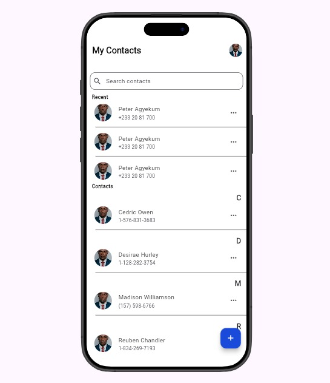

## Contact App

The Contact App is a Flutter-based mobile application designed to display and manage contact information in a simple, elegant, and organized interface. The app features two main screens, a contacts overview page showing both recent and all contacts, and a details page displaying full information when a contact is selected.

# About the Project

This project was developed as part of a personal learning initiative to strengthen skills in Flutter and UI design.
The goal was to build a clean and responsive contact management app that demonstrates the use of Flutter widgets, navigation, and data organization through grouping and list management.

It also serves as a practical example for beginners learning how to structure multi-page Flutter apps and handle data passing between screens.

# Features

Recent Contacts: Displays a list of recently accessed contacts.

All Contacts: Organized and grouped alphabetically for easy browsing.

Contact Details View: Shows detailed information about a selected contact.

Clean UI: Built with Flutter widgets for a smooth and responsive interface.

Scalable Design: Ready for extension to include new features such as search, favorites, or contact editing.

# Project Structure
lib/
main.dart                 # Entry point of the application
contactapphome.dart       # Displays recent and all contacts
contact_details_view.dart # Shows details of a selected contact
contact_model.dart        # file for contact class

# Getting Started

To run this project locally:

1. Clone the repository

git clone https://github.com/AgyekumPeter123/Contact-App-Using-Flutter.git

2. Navigate into the project

cd Contact-App-Using-Flutter

3. Install dependencies

flutter pub get

4. Run the app

flutter run

# App Overview
Screen	Description
Contacts Page	Displays both recent and all contacts grouped alphabetically.
Details Page	Shows full details when a contact is selected.

# Future Enhancements

Add contact search and filtering

Integrate cloud storage for contacts

Enable contact editing and deletion

# License

This project is licensed under the MIT License
feel free to use and modify it for your own projects.

# Author

Name: Peter Agyekum

Email: agyekumpeter123@gmail.com

GitHub: AgyekumPeter123

Phone: 0202381700